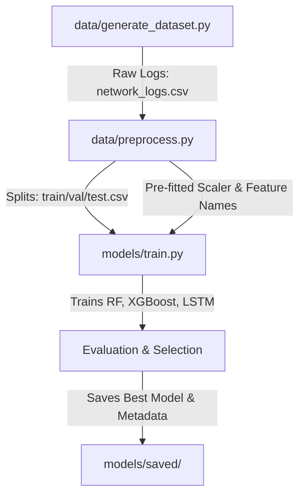
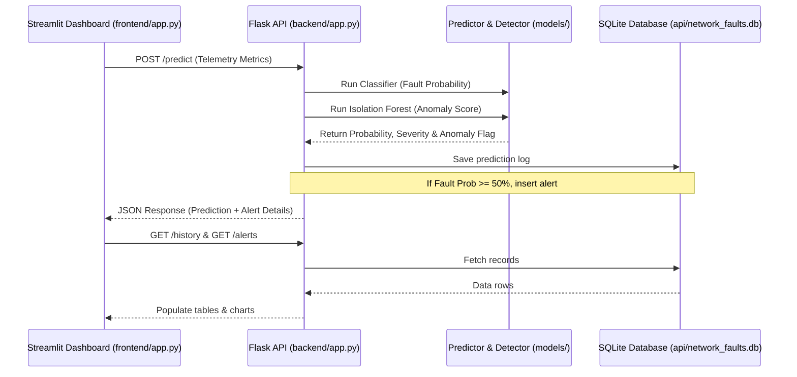

# 📡 AI Telecom Network Fault Prediction System

**Streamlit Dashboard:** [http://localhost:8501](http://localhost:8501)

An end-to-end Machine Learning and Anomaly Detection system for predicting and monitoring telecommunication network faults. The system simulates realistic telecom network telemetry, engineers features, trains multiple classifiers (Random Forest, XGBoost, LSTM), performs unsupervised anomaly detection (Isolation Forest), exposes a REST API, and provides a real-time monitoring Streamlit Dashboard.

---

## 🏗️ System Architecture

The project consists of two core phases: **Machine Learning Pipeline** and **Real-Time Inference & Monitoring**.

### 1. Data & Training Pipeline


### 2. Live Inference & Monitoring Flow


---

## 🌟 Key Features

*   **Telemetry Simulation**: Generates 50,000 logs simulating network telemetry (traffic, latency, packet loss, signal strength, CPU/Memory) from 20 nodes with realistic temporal patterns leading up to failures.
*   **Feature Engineering**: Includes rolling statistics (means and standard deviations of latency, packet loss, error rate) and cyclical time components (sine/cosine transforms of hour and day of week).
*   **Hybrid Modeling Approach**:
    *   *Supervised Learning*: Random Forest, XGBoost, and PyTorch LSTM model training. The system automatically evaluates all three and saves the best model based on F1-score.
    *   *Unsupervised Learning*: Isolation Forest for real-time anomaly detection to capture out-of-distribution network behavior.
*   **REST API Layer**: Flask API providing high-throughput endpoints for predictions, alert resolution, prediction logs history, and model performance metrics.
*   **Interactive Dashboard**: Streamlit-based UI displaying real-time gauges, time-series charts, alert center, model comparison reports, and historical analysis heatmaps.

---

## 📂 Project Structure

```
AI_Telecom_Fault_Prediction/
├── api/                       # Runtime Database
│   └── network_faults.db      # SQLite database storing predictions/alerts
├── backend/                   # Flask REST API
│   ├── alerts.py              # Logic to trigger/format severity alerts
│   ├── app.py                 # REST API endpoints & server setup
│   └── database.py            # SQLite helper routines
├── data/                      # Data Pipeline
│   ├── raw/                   # Raw generated telemetry logs
│   ├── processed/             # Scaled train, validation, and test CSV splits
│   ├── generate_dataset.py    # Simulates synthetic network telemetry dataset
│   └── preprocess.py          # Data cleaner, rolling features & scaling pipeline
├── frontend/                  # Streamlit Dashboard UI
│   └── app.py                 # Multi-page visualization layout
├── models/                    # ML Model Management
│   ├── saved/                 # Saved scaler, model checkpoints, and training metrics
│   ├── anomaly.py             # Unsupervised Isolation Forest wrapper
│   ├── predict.py             # Inference pipeline with model fallbacks
│   └── train.py               # Model trainers (RF, XGBoost, LSTM) & selector
├── ppt_assets/                # Project visual screenshots
├── run.py                     # CLI entry orchestrator
├── requirements.txt           # Python dependencies
├── prototype.html             # Static HTML prototype mockup of the frontend
└── README.md                  # Project Documentation
```
---

## 📈 Model Performance Reference

Below are the benchmark evaluation scores from model training on the test set:

| Model | Accuracy | Precision | Recall | F1-Score | Status |
| :--- | :---: | :---: | :---: | :---: | :--- |
| **XGBoost** | **0.9945** | **0.9068** | **0.9890** | **0.9461** | 🏆 **Best Model (Saved)** |
| **Random Forest** | 0.9925 | 0.8831 | 0.9753 | 0.9269 | Alternate |
| **LSTM (PyTorch)** | 0.9854 | 0.7707 | **0.9973** | 0.8695 | Sequence Classifier |

---

## 🖥️ Streamlit Dashboard Preview

**Streamlit Link:** [http://localhost:8501](http://localhost:8501)

You can monitor nodes and handle alerts directly inside the web UI:

*   **Network Status**: Displays live gauges for CPU/Memory, real-time KPI metrics, and latency/packet loss line charts.
*   **Predictions**: Interactive input form to score custom network states.
*   **Alert Center**: View active alerts categorized by severity (`low`, `medium`, `high`, `critical`) with quick-resolve actions.
*   **Analytics**: View historical hourly fault volume charts and feature correlation heatmaps.
